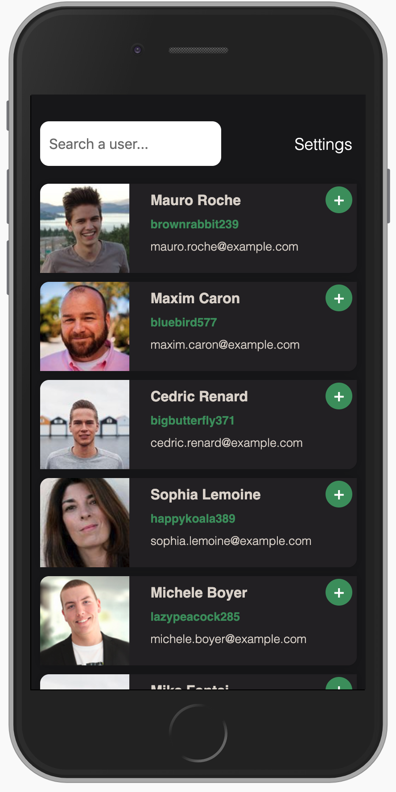
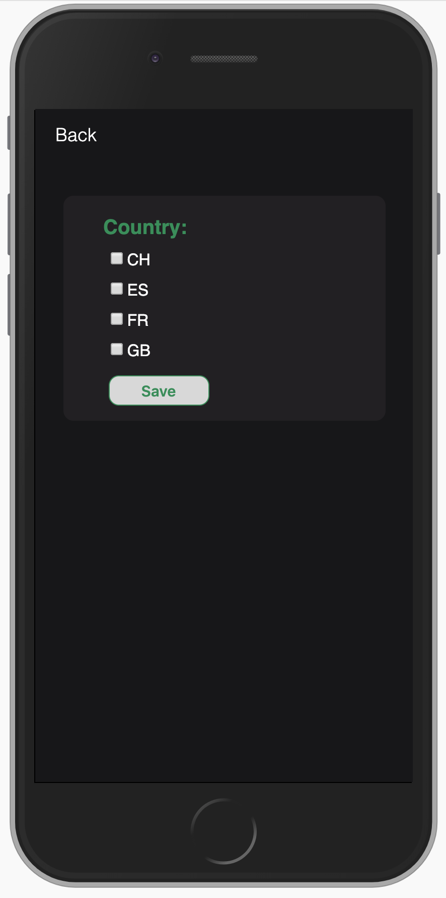
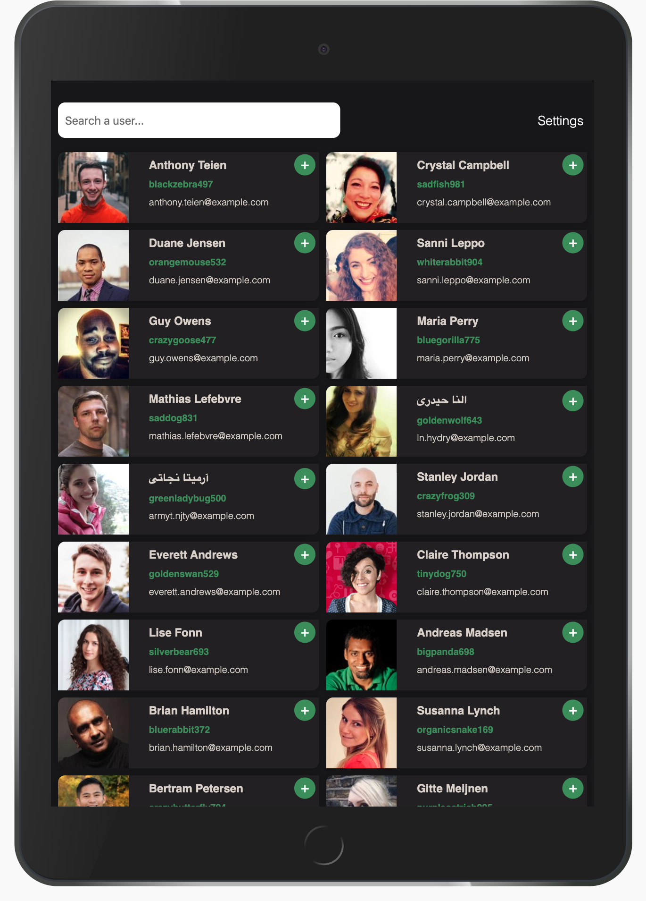

# How to set up the Address Book App on your computer:

1. Download the repository's ZIP file and unzip it.
2. With your terminal navigate inside the unzipped project folder.
3. Type on your terminal 'yarn install' and press ENTER.
4. Type on your terminal 'yarn start' and press ENTER.
5. Chrome will open and go to the local host 'http://localhost:3000/'.

# Responsive on all devices:

1. "Home" page on iPhone 8:

   

  

2. "Settings" page on iPhone 8:

   

  

3. "Home" page on iPad:

   

  

4. "Home" page on desktop device:

   